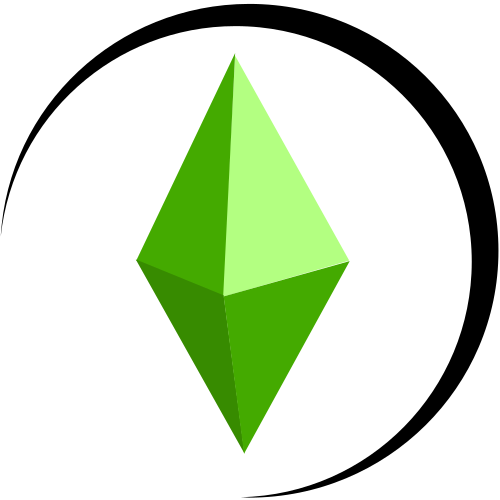

# My Simulation

<p align="center">

</p>
<p align="center">
  

</p>

My Simulation is an **experimental** open source multiplayer game based upon The Sims Online. It attempts to mimic the original game as closely as possible while extending it with new features.

The client is written in Zig and uses Raylib game engine with NioTSO's libraries for interacting with The Sims' proprietary formats. FreeSO's API server is used for the backend.

## Motivation

See [motivation.md](./docs/motivation.md) for motivation and vision.

## Requirements

### Prerequisites

- The Sims Online
- Client
  - [Zig](https://ziglang.org/) 0.11+
- API Server
  - [.NET](https://dotnet.microsoft.com/en-us/) 8.0+
  - [Mockoon](https://mockoon.com/) for mock APIs (Optional)
- Libraries & Tools
  - TBA

### System Requirements

| Platform | Version | Architectures |
| -------- | ------- | ------------- |
| Windows  | 10+     | x86_64, ARM   |
| Linux    | 3.16+   | x86_64        |
| macOS    | 11.0+   | x86_64, ARM   |

## Getting Started

1. **Clone the Repository**:

   ```bash
   git clone https://github.com/simtactics/mysimulation.git
   git submodule update --init --recursive
   ```

   Or, if you have the [Github CLI](https://cli.github.com/)...

   ```bash
   gh repo clone simtactics/mysimulation
   ```

2. **Navigate to the Repository**:

   ```bash
   cd mysimulation
   ```

3. **Run the Client**:

   ```bash
   zig build run
   ```

Further details on building can be found at [compiling.md](./docs/compiling.md).

## Contributing

They're many ways you can contribute to My Simulation such as trying things out, filing bugs, and joining in the discussion!

- How to Contribute (coming soon)
- [Pull Requests](<[https://github.com/tonytins/mysimulatione/pulls](https://github.com/tonytins/mysimulation/pulls)>): [Open](https://github.com/tonytins/mysimulation/pulls)/[Closed](https://github.com/tonytins/mysimulation/pulls?q=is%3Apr+is%3Aclosed)

## License

This program is free software: you can redistribute it and/or modify
it under the terms of the GNU General Public License as published by
the Free Software Foundation, either version 3 of the License, or
(at your option) any later version.

This program is distributed in the hope that it will be useful,
but WITHOUT ANY WARRANTY; without even the implied warranty of
MERCHANTABILITY or FITNESS FOR A PARTICULAR PURPOSE. See the
GNU General Public License for more details.

You should have received a copy of the GNU General Public License
along with this program. If not, see <http://www.gnu.org/licenses/>.

## Disclaimer

My Simulation is not in any way affiliated with Electronic Arts, Maxis or The Sims, it is an unofficial community run project.
