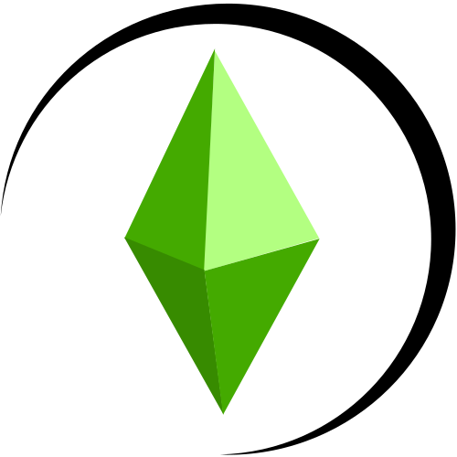

# My Simulation

My Simulation is intended to be an experimental reimplementation of The Sims Online written in Zig that's based on RayLab and NioTSO's C libraries. It uses FreeSO's API server for handling backend.