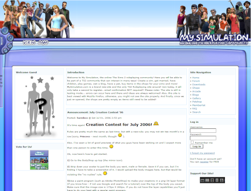

# Motivation

My Simulation began as a short-lived Sims 2 RPG forum created by Gaby, a friend I used to know. Previously, she created an earlier fan site called Sims2Fit. Following financial difficulties, the site was passed down to me. While I was too young to keep it running, at the time, I never let go of the name and what it stood for. It was fun.

Although an established reimplementation of The Sims Online already exists, it has excess legacy baggage due to it originally being based on .NET Framework 3.5 and XNA, causing plenty of performance issues and accessibility remains limited in its current form even after they've moved to MonoGame and .NET Framework 4.x. Trust me, it's a pain to compile. Meanwhile, nioTSO's foundation remains solid, even though it was never finished. It renders Sims and objects flawlessly.

The problem is C is, well, C. ¯\\\_(ツ)\_/¯ It is a powerful language, don't get me wrong, but I don't trust myself enough to use it. Accessing nioTSO's code in safer languages like Go or Rust has been historically difficult. Both comprise the language's promised safety in order to access vital APIs that make up the foundation of modern computing. While Zig is still in its infancy, the language's FFI is solid as well, and fully capable of directly accessing C code directly. No compiling required. Even when wrappers are used, it's a pretty thin layer that allows for idiomatic usage. Zig hasn't even hit 1.0 yet, and already you have an entire stable and mature ecosystem that you can use at the source level. That is unheard of.

This remake of The Sims Online aims to pays homage to My Simulation. Will this succeed in finishing this? _I have no idea_. I'm not much of a game developer, but that hasn't stopped me from dreaming. This is going to be a fun learning experience. That being said, your help is most welcome. I can't do this without you.
